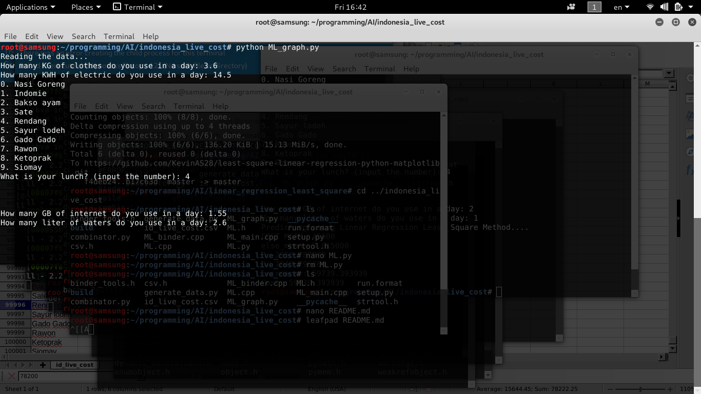
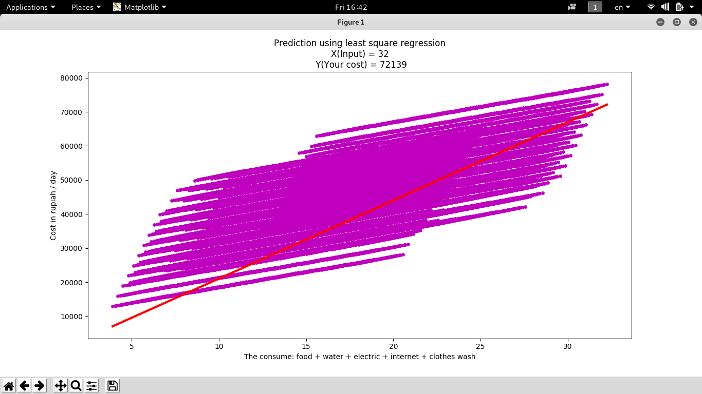

Machine Learning to predict your live cost in indonesia based from data using multiple least square linear regression

the machine learning core is written in c++ language.
can be graphed in python

you can run it with: 

```
 g++ ML.cpp -o ML.o && chmod 755 ML.o && ./ML.o
```

if you want to see the graph, you can run the python one:

```
python setup.py install #install the c++ core
python ML_graph.py #run it
```

to run the graph, you need to install python-developer package, for c++ interfacing with python
install with:

```
sudo apt-get install python-pip python-dev build-essential
```


it will asking you for some input.
for food name, please input the number of food (ex: 1 or 2)





Kevin AS